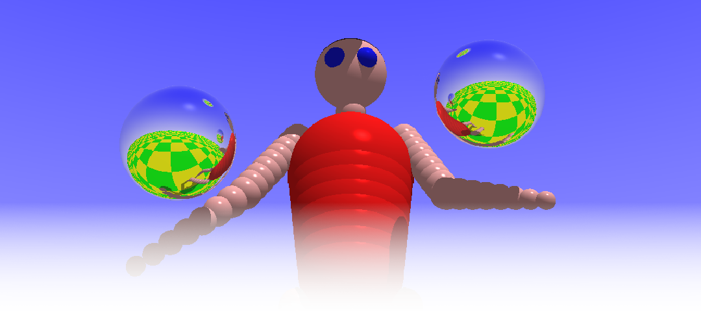

# Juggler in Rust

## Introduction

This is a recreation of the classic 1986 Amiga Juggler demo in the
[Rust](https://www.rust-lang.org/) programming language, mainly intended
to run on the [Raspberry Pi](https://www.raspberrypi.com/) series of
single board computers. Juggler was a famous animation that demonstrated
the use of raytracing algorithms on a home computer.

## Backstory

In January 2024, I decided to start learning the Rust programming
language in earnest. This required a project that was interesting enough
to keep me motivated—something neither too trivial nor too complicated.

As it happens, an article featured on
[Hackaday](https://hackaday.com/2024/01/26/a-zx-spectrum-raytracer-in-basic/)
gave an idea for the perfect project. In the article, Gabriel Gambetta
builds a raytracer in ZX Spectrum BASIC. Gabriel had written an
excellent book that goes into details on how to build your own raytracer
and rasterizer, called [Computer Graphics from
Scratch](https://gabrielgambetta.com/computer-graphics-from-scratch/).

While the Rust implementation of a simple raytracer was getting along
nicely, I stumbled into another article: history of Eric Graham's Amiga
Juggler animation / demo, [curated by Ernie
Wright](http://www.etwright.org/cghist/juggler.html). In the article,
there was a link to an ADF file, which
[BigBaldGeek](https://www.dottyflowers.com/#mozTocId334772) had
extracted from an original _Ray Tracer 1.0_ disk. The disk had the
geometry data for the juggler "robot" figure. I simply had to plug the
data in my raytracer, to see how fast it would run on today's computers…

## Technical Details

According to Eric Graham, the author of the original Juggler demo, a
stock Amiga 1000 with 512 kB of memory would take about an hour to
render each frame. The original animation consists of 24 frames with a
fixed camera pointed at the juggler.

In contrast, this implementation runs in real time on a recent Raspberry
Pi computer. I chose 24 fps to be the target framerate, as the [world
agrees](https://youtu.be/28S47EE_opA?si=ci15gu37hJugGVW8&t=226) that it
is the best framerate. The program does a few test renders on startup to
select a suitable render size that meets or exceeds the target
framerate. In addition to the juggling animation, the camera also
rotates around the juggler.

This is a pure software raytracer implementation. It uses the
[softbuffer](https://crates.io/crates/softbuffer) and
[winit](https://crates.io/crates/winit) Rust crates for displaying the
window, and [vecmath](https://crates.io/crates/vecmath) for the vector
mathematics. No GPU resources are used. A software-only nearest-neighbor
interpolation algorithm is used to scale the rendered image to the
output window size.

There are as many render threads as there are (logical) cores available.
Here's how the program runs on various Raspberry Pi versions:

| Board | Cores | Frequency | RAM | Disk | Full Release Build Time | Display | Render Size | FPS |
| ----- | ----- | --------- | --- | ---- | ----------------------- | ------- | ----------- | --- |
| Pi 5 | 4 × Cortex-A76 | 2400 MHz | 8 GB | USB-3 SSD | 1m52s | Wayland | 320×320 | 30–32 |
| Pi 4 | 4 × Cortex-A72 | 1800 MHz | 8 GB | USB-3 SSD | 5m40s | Wayland | 256×256 | 23–25 |
| Pi 3B+ | 4 × Cortex-A53 | 1400 MHz | 1 GB | USB-2 SSD | 12m22s | X11 | 160×160 | 24–26 |
| Pi Zero W | 1 × ARM11 | 1000 MHz | 512 MB | Micro-SD | 1h29m55s | X11 | 80×80 | 4–5 |

In these tests, the Pi 3B+, 4 and 5 were running Raspberry Pi OS 12
(Bookworm) 64-bit. The Zero W was running Raspberry Pi OS 11 (Bullseye)
32-bit. As you can see, full build times can be quite significant for
Rust programs, due to the large number of dependencies that the crates
pull in. Pi 3B+ and Zero W need a bigger swap than the default 100 MB,
to be able to complete the build.

There are some notable differences to the original raytraced scene:

- The movement of the juggler and the juggling balls was recreated from
scratch. As far as I know, the original movement data for the Juggler
animation was never released.

- I had to lean the juggler back a little bit, so that the balls don't
fly through its chest. This only becomes apparent when the camera moves
around the juggler.

- The floor is true checkerboard, because it just looks nicer, in my
opinion. The original Juggler demo had a checkerboard that was
mirrored along the X and Z axes.

- Lights don't work exactly the same way as in the original animation. I
didn't review the original code to see how it differs to the algorithms
in Gabriel Gambetta's book. This is most apparent on the red highlights
on the juggler's chest, and the light falloff of the ground in the
distance.

- The image is rendered as a square to simplify the calculations related
to the camera and viewport. This approach is subject to future
improvements.

- There is no sound, for now. It would no doubt pull in even more
  dependencies.

## Acknowledgements

I would like to thank the following people for providing the online
resources that this project builds on:

- [Gabriel Gambetta](https://gabrielgambetta.com/)—for the Computer
Graphics from Scratch book.
- [Ernie Wright](http://www.etwright.org/)—for documenting the history
of the Amiga Juggler demo.
- [BigBaldGeek](https://www.dottyflowers.com/)—for finding the original
Ray Tracer 1.0 disk and reading it into an ADF.

And, of course, special thanks to Eric Graham for creating the original
Juggler demo!
